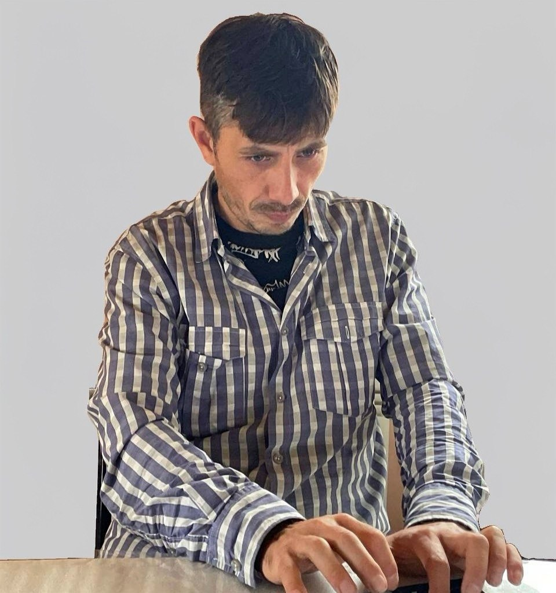

# QA Engineering Portfolio | Anton Pogodin

## QA Engineer | Manual Testing Specialist

## Overview
Collection of practical QA engineering work samples demonstrating testing methodologies and technical skills.

## Portfolio Sections

### Test Design & Strategy
- **Mind Maps**: [API Testing Mind Map](screenshots/1.%20MindCard_API_BackEnd_AP.pdf)
- **Test Cases**: [Authorization Test Cases](screenshots/3.%20Test_Cases.pdf)

### Bug Reporting & Analysis
- **Bug Reports**: [DevTools Bug Reports](screenshots/2.%20Bug_Reports.pdf)

### Test Techniques & Methodologies
- **State Transition**: [Order Status Table](screenshots/4.%20State_Transition_Table.pdf)
- **Decision Tables**: [Discount Rules](screenshots/5.%20Decision_Table_User_Data.pdf)
- **Pairwise Testing**: [Notification Settings](screenshots/6.%20Pairwise_Testing.pdf)
- **Error Guessing**: [Payment Form Testing](screenshots/7.%20Error_Guessing_Technique.pdf)

### Technical Skills
- **SQL Queries**: [Database Testing Examples](screenshots/8.%20SQL_Queries.pdf)
- **API Testing**: [REST API CRUD Operations](screenshots/9.%20API_Testing.pdf)
- **Performance**: [Cross-Platform Performance](screenshots/10.%20Cross_Platform_Performance_Testing.pdf)

## Technical Skills

**Testing Methodologies**
- Manual Testing (Functional, Regression, Smoke)
- Test Design Techniques
- Bug Tracking & Reporting

**Technical Competencies**
- SQL Database Querying
- REST API Testing
- Chrome DevTools
- Git & GitHub

**Tools & Technologies**
- Redmine, Postman, Chrome DevTools

## Contact Information

**Email**: vorsma.tundra37@gmail.com  
**Telegram**: [@AP_Sovereign](https://t.me/AP_Sovereign)  
**GitHub**: [Anton-Pogodin](https://github.com/Anton-Pogodin)